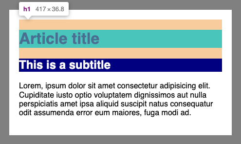
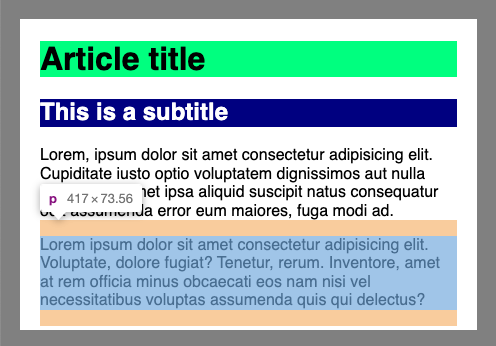

# tailwindcss-collapsible-padding

A plugin that make paddings collapsible with the inner content.

## Why ?

Collapsible padding aims to apply vertical padding on any element while ensuring those padding will blend with the margin-top of its first child and the margin bottom of its last child.

**Common issue:** you apply a padding on a div which contains headings and paragraphs.
By default this padding adds up to the margin of the headings and the paragraphs.



With collapsible padding, the spacings blend together.



## Installation

Install the plugin from npm:

```sh
# Using npm
npm install tailwindcss-collapsible-padding

# Using Yarn
yarn add tailwindcss-collapsible-padding
```

Then add the plugin to your `tailwind.config.js` file:

```js
// tailwind.config.js
module.exports = {
  theme: {
    // ...
  },
  plugins: [
    require('tailwindcss-aspect-ratio'),
    // ...
  ],
  variants: {
    extend: {
      padding: ['collapsible'] // enable the variant on padding utilities
    },
  },
}
```

## Usage

To make a padding collapsible, you need to prefix the utility class with the variant `collapsible`:

```html
<div class="collapsible:p-4">...</div>
```

This variant works on direction-specific utilities:


```html
<div class="collapsible:pt-4 collapsible:pb-8">...</div>
```

> The variant **does not** work on **horizontal**-only utilities (`px-`, `pl-`, `pr-`)

This variant can be combined with a responsive variant:

```html
<div class="collapsible:py-4 md:collapsible:py-8">...</div>
```

## Before using it

Before using this variant, you need to be aware that collapsible paddings rely on the `::before` and `::after` pseudo-elements.

Example of a padding top:

```css
.collapsible\:pt-8::before {
  content: "";
  display: table;
  margin-bottom: 2rem;
}
```

That's right, the padding is a margin under the hood. Keep in mind that margin collapsing is a thing only in a [normal flow](https://developer.mozilla.org/en-US/docs/Web/CSS/CSS_Flow_Layout).

> **What about the `display: table;` ?**   
> This declaration allows the element to exist in the flow while having no content nor any dimension (0x0).